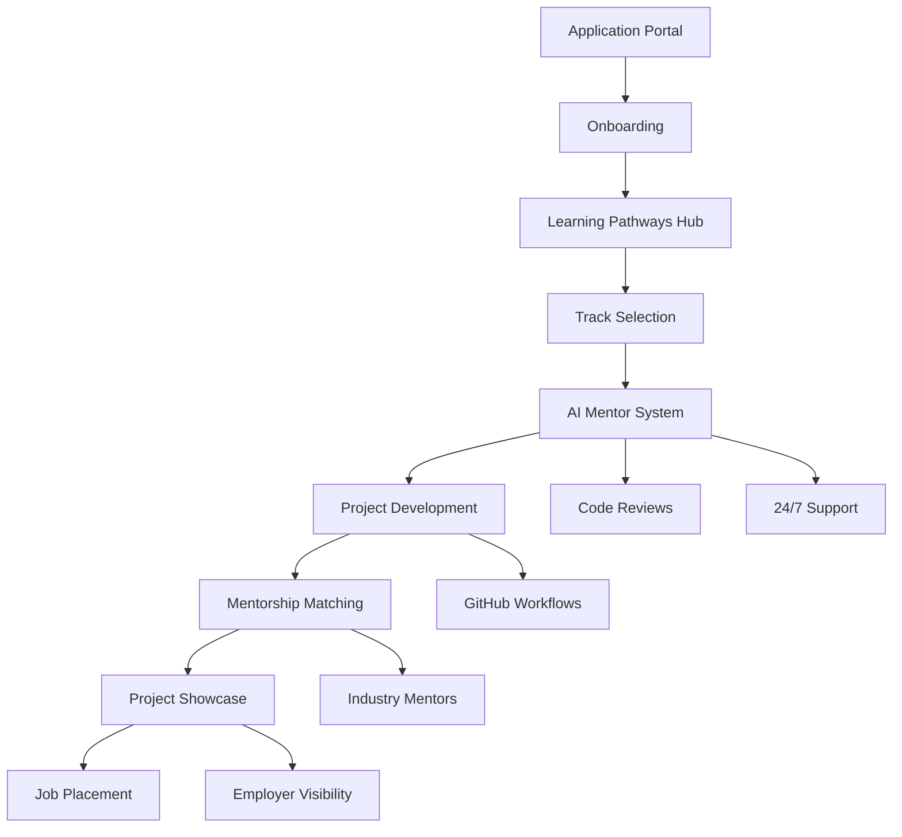

# Second Story Initiative - Product Requirements Document

## 1. Product Overview

The Second Story Initiative is an AI-powered learning ecosystem designed to transform justice-impacted individuals into professional developers through structured learning pathways, AI mentorship, and real-world project experience.

The platform addresses the critical need for accessible, supportive technology education for formerly incarcerated individuals, providing 24/7 AI mentorship, industry-standard development workflows, and direct pathways to employment in the tech sector.

Target market value: Addressing the $1.2B annual cost of recidivism while filling the 3.5M unfilled tech jobs in the US market.

## 2. Core Features

### 2.1 User Roles

| Role | Registration Method | Core Permissions |
|------|---------------------|------------------|
| Learner | Application + background verification | Access learning pathways, AI mentor, project submissions |
| Mentor | Industry invitation + verification | Code review, 1:1 mentorship, curriculum feedback |
| Employer Partner | Partnership agreement | Access talent pipeline, job posting, hiring events |
| Administrator | Internal assignment | Full platform management, analytics, user management |

### 2.2 Feature Module

Our Second Story Initiative platform consists of the following main components:

1. **Learning Pathways Hub**: Structured curriculum tracks, progress tracking, skill assessments
2. **AI Mentor System**: 24/7 Claude-powered code reviews, learning support, career guidance
3. **Project Showcase**: Portfolio development, peer collaboration, employer visibility
4. **Mentorship Matching**: Industry professional pairing, scheduled sessions, progress monitoring
5. **GitHub Organization**: Automated workflows, code repositories, deployment pipelines
6. **Analytics Dashboard**: Learning progress, job placement tracking, success metrics

### 2.3 Page Details

| Page Name | Module Name | Feature Description |
|-----------|-------------|---------------------|
| Learning Pathways Hub | Track Selection | Browse and enroll in Frontend, Backend, AI/ML, or 10x Developer tracks with duration and skill requirements |
| Learning Pathways Hub | Progress Tracking | Visual progress indicators, completed modules, skill assessments, and next steps recommendations |
| Learning Pathways Hub | Curriculum Content | Interactive lessons, coding challenges, project assignments, and resource libraries |
| AI Mentor System | Code Review Bot | Automated pull request reviews with educational feedback, improvement suggestions, and encouragement |
| AI Mentor System | 24/7 Chat Support | Real-time coding help, career guidance, technical explanations, and motivational support |
| AI Mentor System | Learning Analytics | Personalized learning insights, skill gap analysis, and adaptive curriculum recommendations |
| Project Showcase | Portfolio Builder | Create and display completed projects with code repositories, live demos, and technical documentation |
| Project Showcase | Collaboration Hub | Team project formation, peer code reviews, and group challenge participation |
| Project Showcase | Employer Visibility | Public profiles for employer discovery, skill verification, and direct recruitment |
| Mentorship Matching | Mentor Discovery | Browse industry professionals by expertise, company, and availability for 1:1 mentorship |
| Mentorship Matching | Session Scheduling | Calendar integration for mentor meetings, progress check-ins, and career counseling |
| Mentorship Matching | Communication Tools | Video calls, code sharing, goal setting, and progress tracking between mentors and learners |
| GitHub Organization | Repository Management | Automated repo creation for learner projects, template distribution, and access control |
| GitHub Organization | CI/CD Workflows | Automated testing, deployment pipelines, and code quality checks for all projects |
| GitHub Organization | Progress Automation | Automatic progress tracking based on commits, pull requests, and project completions |
| Analytics Dashboard | Learning Metrics | Individual and cohort progress tracking, skill development analytics, and completion rates |
| Analytics Dashboard | Job Placement Tracking | Employment outcomes, salary progression, and career advancement monitoring |
| Analytics Dashboard | Success Stories | Graduate showcases, employer testimonials, and program impact visualization |

## 3. Core Process

**Learner Journey Flow:**
New learners begin with application and background verification, then complete onboarding and environment setup. They select a learning track (Frontend, Backend, AI/ML, or 10x Developer) and progress through structured modules with AI mentor support. Throughout their journey, they build portfolio projects, receive industry mentorship, and participate in job placement activities leading to employment outcomes.

**Mentor Workflow:**
Industry mentors join through partnership agreements, complete profile setup, and get matched with learners based on expertise and availability. They provide code reviews, conduct 1:1 sessions, and track learner progress while contributing to curriculum feedback.

**Employer Partner Process:**
Employer partners establish partnerships, post job opportunities, and access the talent pipeline through the platform. They participate in hiring events, conduct interviews, and provide feedback on graduate performance.

## 4. User Interface Design

### 4.1 Design Style

- **Primary Colors**: Deep blue (#1e3a8a) for trust and professionalism, bright green (#10b981) for growth and success
- **Secondary Colors**: Warm orange (#f59e0b) for encouragement, light gray (#f3f4f6) for backgrounds
- **Button Style**: Rounded corners with subtle shadows, gradient backgrounds for primary actions
- **Font**: Inter for headings (16-24px), Source Code Pro for code blocks (14px), system fonts for body text (14-16px)
- **Layout Style**: Card-based design with clean spacing, top navigation with breadcrumbs, sidebar for quick access
- **Icons**: Heroicons for consistency, custom illustrations for learning concepts, progress badges and achievement icons

### 4.2 Page Design Overview

| Page Name | Module Name | UI Elements |
|-----------|-------------|-------------|
| Learning Pathways Hub | Track Selection | Large cards with track icons, progress bars, estimated completion time, and skill tags with hover animations |
| Learning Pathways Hub | Progress Tracking | Circular progress indicators, milestone badges, skill trees with unlocked/locked states, and celebration animations |
| AI Mentor System | Code Review Bot | Split-pane layout with code diff on left, AI feedback on right, syntax highlighting, and inline comments |
| AI Mentor System | Chat Interface | Clean chat bubbles, code syntax highlighting, typing indicators, and quick action buttons for common requests |
| Project Showcase | Portfolio Grid | Masonry layout with project thumbnails, tech stack badges, live demo buttons, and GitHub integration |
| Mentorship Matching | Mentor Profiles | Professional headshots, expertise tags, availability calendars, and rating systems with testimonials |
| GitHub Organization | Repository Dashboard | GitHub-style interface with commit graphs, pull request status, and automated workflow indicators |
| Analytics Dashboard | Metrics Visualization | Interactive charts with D3.js, progress heatmaps, achievement timelines, and exportable reports |

### 4.3 Responsiveness

The platform is mobile-first responsive design optimized for desktop development workflows while maintaining full functionality on tablets and smartphones. Touch interactions are optimized for mobile code review and chat interfaces, with swipe gestures for navigation and pinch-to-zoom for code viewing.