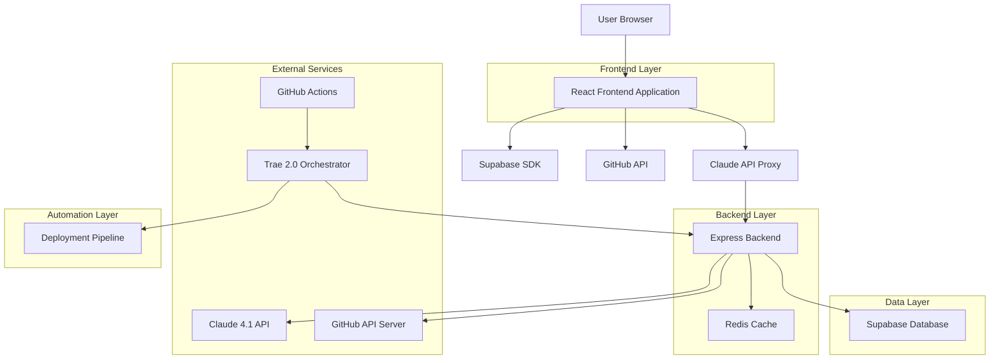
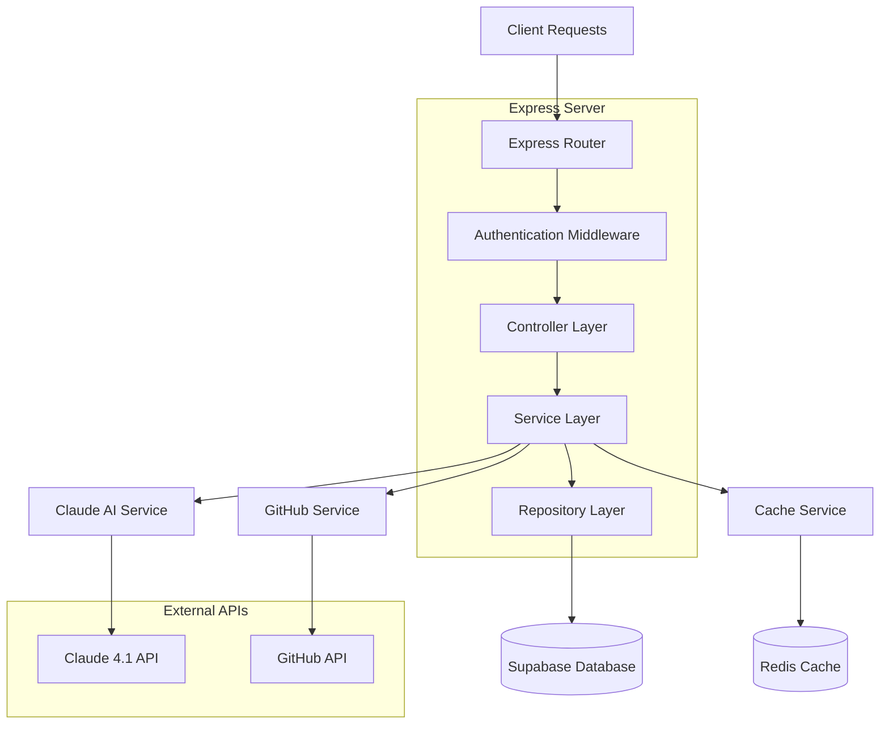
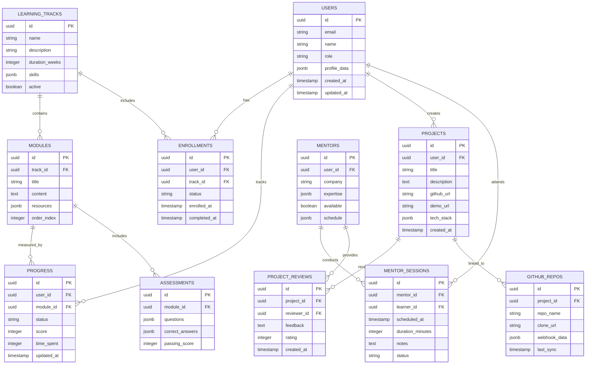

# Second Story Initiative - Technical Architecture Document

## 1. Architecture Design



## 2. Technology Description

* **Frontend**: React\@18 + TypeScript + Tailwind CSS\@3 + Vite + React Router

* **Backend**: Express\@4 + TypeScript + Node.js\@18

* **Database**: Supabase (PostgreSQL) + Redis for caching

* **AI Integration**: Claude 4.1 API (Anthropic)

* **Version Control**: GitHub API + GitHub Actions

* **Orchestration**: Trae 2.0 Builder

* **Authentication**: Supabase Auth

* **Real-time**: Supabase Realtime + WebSockets

## 3. Route Definitions

| Route                    | Purpose                                                          |
| ------------------------ | ---------------------------------------------------------------- |
| /                        | Landing page with program overview and application CTA           |
| /apply                   | Application form for new learners with background verification   |
| /onboarding              | Environment setup and initial assessment for accepted learners   |
| /dashboard               | Personalized learner dashboard with progress and recommendations |
| /pathways                | Learning track selection and curriculum overview                 |
| /pathways/:track         | Specific track content (frontend, backend, ai-ml, 10x-developer) |
| /pathways/:track/:module | Individual module content with lessons and challenges            |
| /mentor                  | AI mentor chat interface with code review capabilities           |
| /projects                | Project showcase and portfolio management                        |
| /projects/:id            | Individual project details with code repository integration      |
| /mentorship              | Human mentor matching and session scheduling                     |
| /mentorship/:mentorId    | Mentor profile and booking interface                             |
| /profile                 | Learner profile management and achievement tracking              |
| /analytics               | Progress analytics and learning insights (admin/mentor view)     |
| /admin                   | Administrative dashboard for program management                  |

## 4. API Definitions

### 4.1 Core API

**Authentication**

```
POST /api/auth/login
```

Request:

| Param Name | Param Type | isRequired | Description        |
| ---------- | ---------- | ---------- | ------------------ |
| email      | string     | true       | User email address |
| password   | string     | true       | User password      |

Response:

| Param Name | Param Type | Description                        |
| ---------- | ---------- | ---------------------------------- |
| user       | object     | User profile data                  |
| session    | object     | Authentication session             |
| role       | string     | User role (learner, mentor, admin) |

**AI Mentor Integration**

```
POST /api/mentor/review
```

Request:

| Param Name  | Param Type | isRequired | Description                     |
| ----------- | ---------- | ---------- | ------------------------------- |
| code        | string     | true       | Code content for review         |
| context     | string     | false      | Additional context or questions |
| learner\_id | string     | true       | Learner identifier              |

Response:

| Param Name  | Param Type | Description                 |
| ----------- | ---------- | --------------------------- |
| review      | object     | AI-generated code review    |
| suggestions | array      | Improvement recommendations |
| resources   | array      | Learning resource links     |

**Learning Progress**

```
PUT /api/progress/:moduleId
```

Request:

| Param Name         | Param Type | isRequired | Description                           |
| ------------------ | ---------- | ---------- | ------------------------------------- |
| completion\_status | string     | true       | completed, in\_progress, not\_started |
| score              | number     | false      | Assessment score (0-100)              |
| time\_spent        | number     | true       | Time spent in minutes                 |

Response:

| Param Name   | Param Type | Description                 |
| ------------ | ---------- | --------------------------- |
| updated      | boolean    | Update success status       |
| next\_module | object     | Next recommended module     |
| achievements | array      | Newly unlocked achievements |

**GitHub Integration**

```
POST /api/github/create-repo
```

Request:

| Param Name    | Param Type | isRequired | Description           |
| ------------- | ---------- | ---------- | --------------------- |
| project\_name | string     | true       | Repository name       |
| template      | string     | true       | Project template type |
| learner\_id   | string     | true       | Learner identifier    |

Response:

| Param Name          | Param Type | Description            |
| ------------------- | ---------- | ---------------------- |
| repo\_url           | string     | Created repository URL |
| clone\_url          | string     | Git clone URL          |
| setup\_instructions | array      | Next steps for learner |

## 5. Server Architecture Diagram



## 6. Data Model

### 6.1 Data Model Definition



### 6.2 Data Definition Language

**Users Table**

```sql
-- Create users table
CREATE TABLE users (
    id UUID PRIMARY KEY DEFAULT gen_random_uuid(),
    email VARCHAR(255) UNIQUE NOT NULL,
    name VARCHAR(100) NOT NULL,
    role VARCHAR(20) DEFAULT 'learner' CHECK (role IN ('learner', 'mentor', 'admin', 'employer')),
    profile_data JSONB DEFAULT '{}',
    created_at TIMESTAMP WITH TIME ZONE DEFAULT NOW(),
    updated_at TIMESTAMP WITH TIME ZONE DEFAULT NOW()
);

-- Row Level Security
ALTER TABLE users ENABLE ROW LEVEL SECURITY;

CREATE POLICY "Users can view own profile" ON users
    FOR SELECT USING (auth.uid() = id);

CREATE POLICY "Users can update own profile" ON users
    FOR UPDATE USING (auth.uid() = id);

-- Grant permissions
GRANT SELECT ON users TO anon;
GRANT ALL PRIVILEGES ON users TO authenticated;
```

**Learning Tracks Table**

```sql
-- Create learning_tracks table
CREATE TABLE learning_tracks (
    id UUID PRIMARY KEY DEFAULT gen_random_uuid(),
    name VARCHAR(100) NOT NULL,
    description TEXT,
    duration_weeks INTEGER NOT NULL,
    skills JSONB DEFAULT '[]',
    active BOOLEAN DEFAULT true,
    created_at TIMESTAMP WITH TIME ZONE DEFAULT NOW()
);

-- Create indexes
CREATE INDEX idx_learning_tracks_active ON learning_tracks(active);
CREATE INDEX idx_learning_tracks_name ON learning_tracks(name);

-- Grant permissions
GRANT SELECT ON learning_tracks TO anon;
GRANT ALL PRIVILEGES ON learning_tracks TO authenticated;

-- Insert initial data
INSERT INTO learning_tracks (name, description, duration_weeks, skills) VALUES
('Frontend Developer', 'HTML, CSS, JavaScript, React fundamentals', 12, '["HTML", "CSS", "JavaScript", "React", "Git"]'),
('Backend Engineer', 'Server-side development with Node.js and databases', 16, '["Node.js", "Express", "PostgreSQL", "APIs", "Authentication"]'),
('AI/ML Engineer', 'Python, machine learning, and AI integration', 20, '["Python", "TensorFlow", "LangChain", "APIs", "Data Science"]'),
('10x Developer', 'Full-stack development with system design', 24, '["React", "Node.js", "System Design", "DevOps", "Leadership"]');
```

**Progress Tracking Table**

```sql
-- Create progress table
CREATE TABLE progress (
    id UUID PRIMARY KEY DEFAULT gen_random_uuid(),
    user_id UUID REFERENCES users(id) ON DELETE CASCADE,
    module_id UUID REFERENCES modules(id) ON DELETE CASCADE,
    status VARCHAR(20) DEFAULT 'not_started' CHECK (status IN ('not_started', 'in_progress', 'completed')),
    score INTEGER CHECK (score >= 0 AND score <= 100),
    time_spent INTEGER DEFAULT 0,
    updated_at TIMESTAMP WITH TIME ZONE DEFAULT NOW(),
    UNIQUE(user_id, module_id)
);

-- Create indexes
CREATE INDEX idx_progress_user_id ON progress(user_id);
CREATE INDEX idx_progress_module_id ON progress(module_id);
CREATE INDEX idx_progress_status ON progress(status);
CREATE INDEX idx_progress_updated_at ON progress(updated_at DESC);

-- Row Level Security
ALTER TABLE progress ENABLE ROW LEVEL SECURITY;

CREATE POLICY "Users can view own progress" ON progress
    FOR SELECT USING (auth.uid() = user_id);

CREATE POLICY "Users can update own progress" ON progress
    FOR ALL USING (auth.uid() = user_id);

-- Grant permissions
GRANT SELECT ON progress TO anon;
GRANT ALL PRIVILEGES ON progress TO authenticated;
```

**Projects Table**

```sql
-- Create projects table
CREATE TABLE projects (
    id UUID PRIMARY KEY DEFAULT gen_random_uuid(),
    user_id UUID REFERENCES users(id) ON DELETE CASCADE,
    title VARCHAR(200) NOT NULL,
    description TEXT,
    github_url VARCHAR(500),
    demo_url VARCHAR(500),
    tech_stack JSONB DEFAULT '[]',
    status VARCHAR(20) DEFAULT 'in_progress' CHECK (status IN ('planning', 'in_progress', 'completed', 'showcased')),
    created_at TIMESTAMP WITH TIME ZONE DEFAULT NOW(),
    updated_at TIMESTAMP WITH TIME ZONE DEFAULT NOW()
);

-- Create indexes
CREATE INDEX idx_projects_user_id ON projects(user_id);
CREATE INDEX idx_projects_status ON projects(status);
CREATE INDEX idx_projects_created_at ON projects(created_at DESC);

-- Row Level Security
ALTER TABLE projects ENABLE ROW LEVEL SECURITY;

CREATE POLICY "Users can manage own projects" ON projects
    FOR ALL USING (auth.uid() = user_id);

CREATE POLICY "Public can view completed projects" ON projects
    FOR SELECT USING (status = 'showcased');

-- Grant permissions
GRANT SELECT ON projects TO anon;
GRANT ALL PRIVILEGES ON projects TO authenticated;
```

